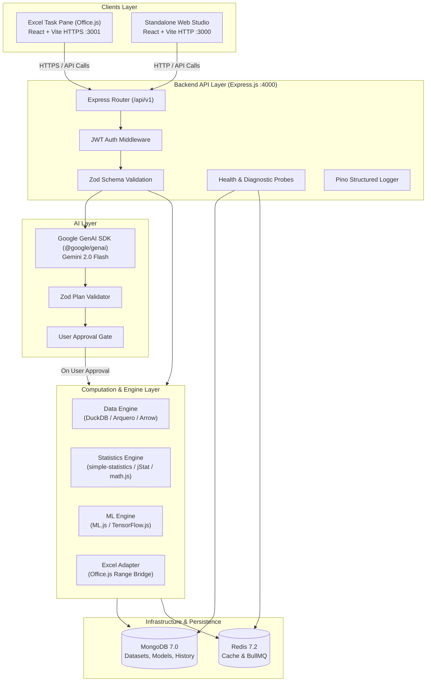
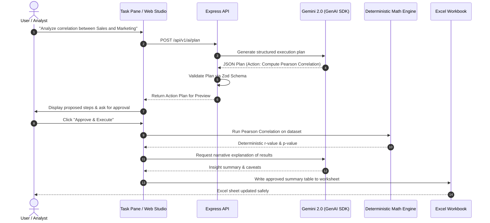

# Gemini DataLab - Architecture Overview

## System Architecture

```mermaid
graph TD
    subgraph Clients["Clients Layer"]
        ExcelAddin["Excel Task Pane (Office.js)<br/>React + Vite HTTPS :3001"]
        WebApp["Standalone Web Studio<br/>React + Vite HTTP :3000"]
    end

    subgraph API["Backend API Layer (Express.js :4000)"]
        Router["Express Router (/api/v1)"]
        AuthMiddleware["JWT Auth Middleware"]
        ZodValidator["Zod Schema Validation"]
        HealthProbes["Health & Diagnostic Probes"]
        Logger["Pino Structured Logger"]
    end

    subgraph DataScience["Computation & Engine Layer"]
        DataEngine["Data Engine<br/>(DuckDB / Arquero / Arrow)"]
        StatsEngine["Statistics Engine<br/>(simple-statistics / jStat / math.js)"]
        MLEngine["ML Engine<br/>(ML.js / TensorFlow.js)"]
        ExcelEngine["Excel Adapter<br/>(Office.js Range Bridge)"]
    end

    subgraph AI["AI Layer"]
        GeminiPlanner["Google GenAI SDK (@google/genai)<br/>Gemini 2.0 Flash"]
        PlanValidator["Zod Plan Validator"]
        ApprovalGate["User Approval Gate"]
    end

    subgraph Infrastructure["Infrastructure & Persistence"]
        MongoDB[(MongoDB 7.0<br/>Datasets, Models, History)]
        Redis[(Redis 7.2<br/>Cache & BullMQ)]
    end

    ExcelAddin -->|HTTPS / API Calls| Router
    WebApp -->|HTTP / API Calls| Router

    Router --> AuthMiddleware
    AuthMiddleware --> ZodValidator
    ZodValidator --> GeminiPlanner
    ZodValidator --> DataScience

    GeminiPlanner --> PlanValidator
    PlanValidator --> ApprovalGate
    ApprovalGate -->|On User Approval| DataScience

    DataScience --> MongoDB
    DataScience --> Redis
    HealthProbes --> MongoDB
    HealthProbes --> Redis
```

## AI Execution Pipeline

```mermaid
sequenceDiagram
    autonumber
    actor User as User / Analyst
    participant UI as Task Pane / Web Studio
    participant API as Express API
    participant AI as Gemini 2.0 (GenAI SDK)
    participant Engine as Deterministic Math Engine
    participant Excel as Excel Workbook

    User->>UI: "Analyze correlation between Sales and Marketing"
    UI->>API: POST /api/v1/ai/plan
    API->>AI: Generate structured execution plan
    AI-->>API: JSON Plan (Action: Compute Pearson Correlation)
    API->>API: Validate Plan via Zod Schema
    API-->>UI: Return Action Plan for Preview
    UI->>User: Display proposed steps & ask for approval
    User->>UI: Click "Approve & Execute"
    UI->>Engine: Run Pearson Correlation on dataset
    Engine-->>UI: Deterministic r-value & p-value
    UI->>AI: Request narrative explanation of results
    AI-->>UI: Insight summary & caveats
    UI->>Excel: Write approved summary table to worksheet
    Excel-->>User: Excel sheet updated safely
```
